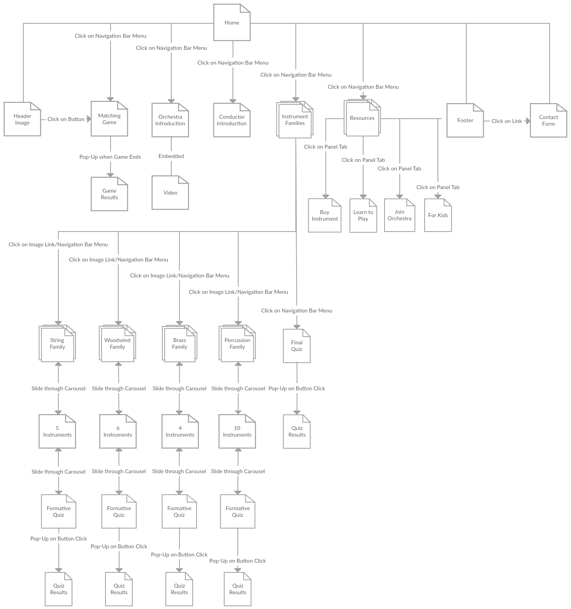
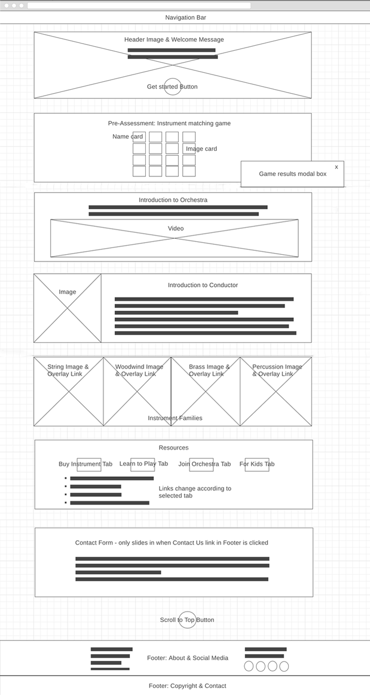
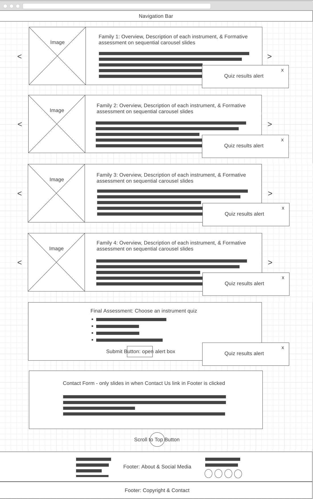

# **Design Document**

For my final project, I'm building on what I had done for my midterm project.

I renamed my website **Zynfonia** to be a bit more edgy as many people think that classical music and the orchestra is boring, and I don't want them to have that mindset when exploring my site. I also changed the learning objective and target users of the site. Zynfonia now is a learning resource for beginner level adult musicians. The site can be accessed at this [Github Page link](https://ewongosari.github.io/final/). During the design thinking process, I have implemented Jesse Garrett's *Model of 5 Elements of User Experience*, which are outlined in the following sections. This method is basically a backward design process that helps designers like me to focus on the design vision or objective while making important decisions. That way my end product would not deviate too much from its true purpose. I will also explain how I have utilized the learning theories of *motivation, microlearning, cognitive overload, multimedia learning, and multiple learning styles* to influence the design and creation of my website.

## Topic
The domain of my website is music education, and its subject is orchestra education. The main purpose for this website is **to facilitate novice adult musicians to choose an orchestral instrument after they acquire all necessary knowledge about each instrument and instrument family**. As my website is only a small component of orchestra education, it can be linked to other orchestra-focused websites to teach the whole spectrum of orchestra education topics. It can also serve as an introductory component to other music websites or programs that teach how to play the musical instruments, sell the instruments they need, and offer listing of possible orchestras to join.

## Problem

### Learning Problem
The main problem that I need to tackle with this topic of learning about orchestral musical instruments is the **huge amount of available information** scattered around the Internet. It seems that each prominent symphony orchestra has an educational section on its website. This is also not counting other music-related websites that are not affiliated with the orchestra, ranging from theory-focused to learning about practical instrument playing. Fortunately, a majority of the topic information overlaps but there are still many different variations. Thus, a beginner learner can **feel extremely overwhelmed**.

### Solution and Rationale
I determined that having **a central hub of information** is crucial, especially for **scaffolding beginning learners**, so that they would not be overwhelmed at the start and lose their motivation to learn. I also applied the **microlearning strategy**, in which information are presented in small chunks at a time, to help learners to easily digest new information and reduce the chances of **cognitive overload**. Now most of the orchestra education websites I have come across in my research are very text-heavy. At most, they employ pictures and some audio but they are not organized well with the main content. Thus, I have implemented the **multimedia learning theory** that states that simultaneous iterations of the same content in different multimedia formats may help learners to retain information better than just text-based content. At the same time, I am able to cover the different **learning styles** of my learners--visual, auditory, and kinesthetic.

## Target Audience
My target audience are **adult learners from college age to older who want to learn about the different orchestral instruments so that they can choose which one to learn.** They can be interested in the topic because they are taking music lessons, are music teachers themselves, or are planning to join an orchestra. I have described below some **user stories** to put these types of learners in more detailed context:

### User Stories

* **User Story 1:**

  

  This is Jaime. She is a senior majoring in TESOL in a 4-year liberal-arts college. As part of the elective requirements for her degree, she is taking a beginner music lesson this semester. She needs to pick out a music instrument before she can actually register for the class. Because she knows nothing about music instruments, she decides to do some research. But Jaime is soon overwhelmed by the amount of information in the Internet and many of them have different perspectives. In addition, she is having a full load of taking classes and student teaching at a public middle school, thus she cannot spend too much time in analyzing information. She reaches out to her music professor for guidance and the professor points out my website as a resource. Jaime likes the bite-sized content as it is not overwhelming and the instrument recommendation really helps her to reduce her options.

* **User Story 2:**

  

  This is Flora. She is a private music teacher who teaches children violin, guitar, piano, and harp. Her most recent potential client is Leanne, a single mother working as a bank manager with precocious 9 year old twin daughter and son. Leanne wants her children to master at least one musical instrument in their lives. She had heard that Flora is an extremely professional and proficient teacher so she wants to recruit her. But both Leanne and her children have no idea on which instrument is the best for them. Due to her busy schedule at work and at home, she does not have much time to do her research. So Flora provides my website as a resource to help her and her children make a decision. Flora and Leanne like that the website has a minimalistic yet aesthetically-pleasing look and it is easy to find the relevant content. The information on each instrument are also written in a simple-to-understand language and the supplementary multimedia helps to reinforce the content.

* **User Story 3:**

  

  This is Greg. He is a car dealer in his 50s. For his recent marriage anniversary's present, one of his children gave him a pair of VIP tickets to the orchestra for his wife and him to enjoy. He had never been to the orchestra at all in his life but after the experience, he becomes very inspired to learn an instrument. He decides that he really need some background information so he can choose an instrument that he is most interested in. Fortunately, one of his son-in-law is a high school music teacher and he recommended my website for Greg as it is very simple to navigate. Greg likes that all content are short and to the point, and the multimedia content help him to understand better as he is mainly a visual learner.

## Strategy

### Site Objectives
* **Learning Objectives:**
  * SWBAT know and understand the four instrument families within an orchestra and the main music instruments representing each family after they have gone through the provided content materials.
  * SWBAT choose a music instrument based on the information and recommendation they acquire.

* **Learning Goals:**
  * SWBAT know and understand an overview of the orchestra and the stage positions of each instrument family.
  * SWBAT know and understand the different traits of each instrument families.
  * SWBAT know and understand each musical instrument through text descriptions, pictures, audio, and videos.
  * SWBAT take the final assessment to get a recommendation on which instrument they should learn, and make a decision based on that.

### Success Metrics
* **Pre-assessment:**
  * My pre-assessment is in the form of an interactive matching game that test the learner's prior knowledge about the topic. They have to match instrument picture cards with their respective name cards. In a fun way, learners can find out how much do they already know about identifying music instruments. Then they can navigate to the relevant content that they have not known about.

* **Formative assessments:**
  * My formative assessments is in the form of short true or false quizzes provided at the end of each instrument family content. They test how well learners have retained the new information they acquire. The quizzes offer learners the opportunity to re-take them as many times they want after they re-learn the content materials until they are able to reach their desired score.

* **Final assessment:**
  * My final assessment is in the form of a short multiple-choice quiz that learners take after they are done exploring all content on music instruments. Based on the inputs, learners are given a recommendation on a music instrument that they can choose to learn.

## Scope
* Here are the **technical or functional specifications** for my website:
  * A *navigation menu bar* that always sits on top of the page
  * *Menu bar links* to different sections on a webpage
  * *Image links* to different instrument families, which are in another page
  * *Resource section links* to different panes in the same container
  * *Slideshow format* of learning content through the use of carousels
  * Displaying *pictures and text side-by-side* to save space
  * Displaying *content in tables with no borders* for better organization
  * Ability to *play embedded videos*
  * Ability to *play embedded audio samples and videos* in carousel slides
  * Ability to *take interactive game and quizzes*, even in carousels
  * Ability to *scroll long content in a container*
  * *Animated sections* with page scrolling
  * *Active menu links can update* with page scrolling
  * *Scroll to target animation* when clicking on menu links
  * *Scroll to top button* for easier navigation
  * *Social media network links* for spreading the word on my website
  * *Contact us link* to a contact form that can slide up or down to toggle visibility

* Here are the **content specifications** for my website:
  * A *welcoming message* in the header image where learners can get a sense of the purpose of the website
  * A short *pre-assessment* to gauge learners' prior knowledge
  * A short *video introduction* about the orchestra as an overview for the whole topic
  * A short *introduction* about the conductor's role
  * *Descriptions* of each instrument family
  * *Descriptions* of each instrument
  * *Pictures* of each instrument
  * Short *audio samples* of each instrument
  * Short *videos* of how to play each instrument
  * Short *formative assessments* to figure out how much information the learners understand
  * A *final assessment* to figure out which instrument is the best fit for each learner
  * *Resources* that link to the next actions the learners can take after choosing an instrument
  * A *contact form* to send a message to the site administrator for feedback, requests, complaints, and questions, etc.

## Structure
Here is the **sitemap structure** and **navigation design** of my website:

* Rationale - Reducing navigation links and keeping information in clusters help to keep the learning process in a streamlined manner. All sections can be accessed from the navigation menu and through the links as noted in the diagram below.

## Skeleton
Here are the **wireframes** for my website:

* Index.html
  * The home page of my website consists of the things a learner will encounter before the main lesson, such as introduction to topic and a short pre-assessment. There is also a section on further resources that the learner can explore after they are done with the lessons and the option to share my website on social media networks if they like it as a learning resource. I think this is important to spread the word to other learners who are looking to learn my topic and to increase my website traffic. Because of the nature of my long webpages, I have fixed the navigation bar to be always at the top while scrolling, and inserted navigation menu to scroll to each information section and scroll buttons for more efficient navigation.

* Instruments.html
  * The main learning content for my website is situated at this page. Because there are four families of instruments, I have grouped the instruments in each family together using sliding carousels. Each instrument family has its own formative assessment. There is also a final assessment that help learners to choose the best instrument that fit them. Learners can always go back to the home page by clicking on the website logo.

